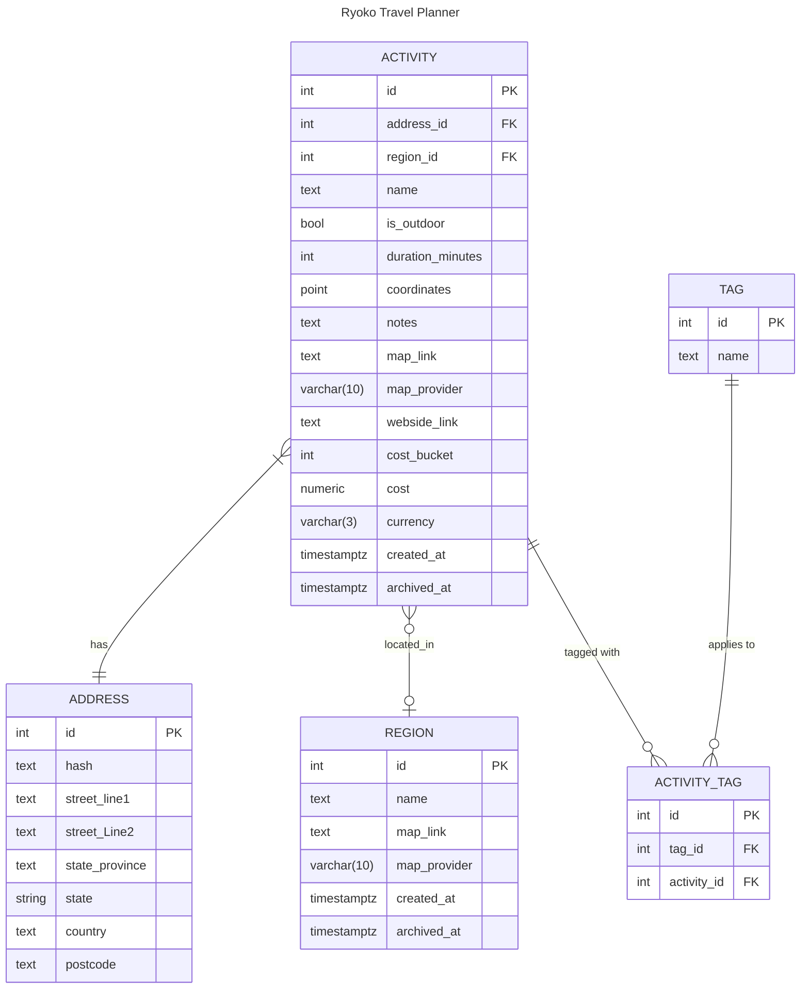

### Entity Relationship Diagram

### Referneces 

Resource about "tagging" database schemas: [link](http://howto.philippkeller.com/2005/04/24/Tags-Database-schemas/)

SO about options for enums in a db: [link](https://stackoverflow.com/questions/10923213/postgres-enum-data-type-or-check-constraint)